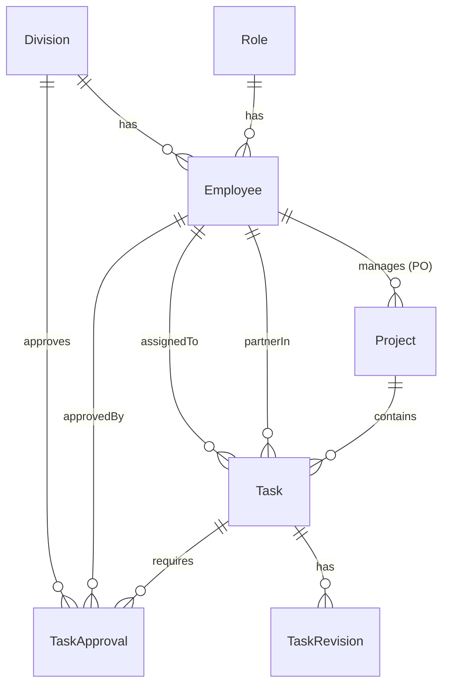

# 📄 DOKUMENTASI KONTEKS & FITUR LENGKAP — LOCO 21 PRO

Dokumen ini menyajikan analisis menyeluruh tentang **LOCO 21 PRO**, sebuah platform manajemen tugas internal (*task tracking system*) yang dirancang khusus dengan sistem penilaian performa karyawan (KPI) berbasis gamifikasi. Dokumen ini bertujuan untuk memberikan konteks menyeluruh mengenai arsitektur sistem, skema database, detail fitur, alur kerja bisnis, serta daftar API integrasi untuk mempermudah pengembangan dan pemeliharaan sistem.

---

## 📂 Daftar Isi
1. [Ringkasan Proyek & Konteks Bisnis](#1-ringkasan-proyek--konteks-bisnis)
2. [Arsitektur Sistem & Stack Teknologi](#2-arsitektur-sistem--stack-teknologi)
3. [Skema Database & Relasi Data (Prisma ORM)](#3-skema-database--relasi-data-prisma-orm)
4. [Akses Kontrol Berbasis Peran (RBAC)](#4-akses-kontrol-berbasis-peran-rbac)
5. [Logika & Alur Fitur Utama](#5-logika--alur-fitur-utama)
   - [Siklus Hidup Tugas (Task Lifecycle)](#siklus-hidup-tugas-task-lifecycle)
   - [Sistem Approval Cerdas (Smart Approval Routing)](#sistem-approval-cerdas-smart-approval-routing)
   - [Algoritma Perhitungan KPI & Kebijakan Periode](#algoritma-perhitungan-kpi--kebijakan-periode)
   - [Aktivasi Akun Baru & Alur Verifikasi Email](#aktivasi-akun-baru--alur-verifikasi-email)
   - [Notifikasi Kontekstual & Ringkasan AI](#notifikasi-kontekstual--ringkasan-ai)
6. [Arsitektur API & Endpoint Integrasi](#6-arsitektur-api--endpoint-integrasi)
7. [Desain UI Frontend (Atomic Design)](#7-desain-ui-frontend-atomic-design)
8. [Daftar Akun Pengujian (Seeder Credentials)](#8-daftar-akun-pengujian-seeder-credentials)

---

## 1. Ringkasan Proyek & Konteks Bisnis

Di dalam lingkungan agensi atau organisasi berkinerja tinggi, koordinasi tugas antar-divisi dan penilaian kinerja karyawan sering kali menjadi tantangan. **LOCO 21 PRO** hadir sebagai solusi sistem pelacak tugas (*task tracker*) yang mengintegrasikan aspek koordinasi proyek dengan penilaian performa kerja secara transparan dan objektif.

Aplikasi ini tidak hanya mencatat tugas harian, tetapi juga:
*   **Mengukur kontribusi riil** karyawan berdasarkan tipe tugas (apakah itu pekerjaan utama, dukungan/support untuk divisi lain, kolaborasi, atau ide perbaikan mandiri).
*   **Menghitung KPI secara otomatis** dengan mempertimbangkan ketepatan waktu, kualitas hasil (jumlah revisi), serta tingkat inisiatif dan kerja sama tim.
*   **Menyediakan alur persetujuan terstruktur** untuk memastikan setiap output kerja telah divalidasi oleh pihak yang berwenang sebelum dianggap selesai.

---

## 2. Arsitektur Sistem & Stack Teknologi

LOCO 21 PRO dirancang dengan arsitektur modern yang meminimalkan latensi dan memaksimalkan kemudahan pemasangan:

*   **SPA Shell (Single Page Application)**: Frontend dibangun menggunakan **Next.js 16** (App Router) dengan satu halaman utama (`app/page.tsx`) sebagai pusat pengelolaan state (*state orchestrator*). Transisi halaman dilakukan secara client-side untuk memberikan pengalaman pengguna yang sangat cepat tanpa reload halaman.
*   **Styling & UI**: Menggunakan **Tailwind CSS v4** yang dioptimalkan dengan token warna kustom bertema *Light-Red* dan elemen visual *glassmorphic* premium.
*   **Database & ORM**: Menggunakan **MariaDB/MySQL** yang dikelola melalui **Prisma ORM**. Seluruh relasi data dinormalisasi dengan baik untuk memastikan integritas data.
*   **Email Engine**: Menggunakan **Nodemailer** dengan sistem dual-mode (SMTP Real & Simulasi File HTML Lokal) untuk mempermudah pengujian di lingkungan lokal tanpa konfigurasi SMTP yang rumit.

---

## 3. Skema Database & Relasi Data (Prisma ORM)

Database dirancang dengan struktur ternormalisasi untuk mendukung pencatatan riwayat revisi tugas dan pelacakan approval multi-pihak. Berikut adalah pemodelan data utama pada [schema.prisma](file:///Users/potah/Documents/webdev/tasktrackerloco/prisma/schema.prisma):

### 📊 Entity Relationship Diagram (ERD)



### 📝 Penjelasan Model & Field Tabel

1.  **Division (`divisions`)**
    *   Menyimpan divisi organisasi (misal: *Operation*, *Admin & Finance*, *Marketing*, *Creative & Program*).
    *   Relasi: Memiliki banyak Karyawan (`employees`) dan Data Approval (`taskApprovals`).
2.  **Role (`roles`)**
    *   Menyimpan tingkat peran akses (yaitu: *Admin*, *Manager*, *Karyawan*).
    *   Relasi: Menentukan hak akses Karyawan.
3.  **Employee (`employees`)**
    *   Menyimpan data identitas karyawan, email, kata sandi, status akun (`Aktif`/`Menunggu`), serta token verifikasi email (`verificationToken`) dan masa berlaku token (`tokenExpires`).
    *   Relasi: Terhubung ke `Division`, `Role`, menjadi pelaksana utama tugas (`assignedTasks`), partner tugas (`partnerTasks`), Project Officer (`managedProjects`), serta pemberi persetujuan (`taskApprovals`).
4.  **Project (`projects`)**
    *   Menyimpan data proyek/klien, durasi (tanggal mulai/selesai), dan status proyek (`Pitching`, `Fix`, `Pending`, `Cancel`).
    *   Relasi: Dipimpin oleh seorang Project Officer (PO) dari tabel `Employee`, dan menampung banyak `Task`.
5.  **Task (`tasks`)**
    *   Menyimpan data detail tugas, deadline (`date`), tingkat prioritas (`High`, `Medium`, `Low`), tipe tugas (`Core`, `Support`, `Colaboration`, `Improvement`), status tugas (`To Do`, `In Progress`, `Done`, `Approved`, `Revisi`), tautan bukti kerja (`resultLink`), nama berkas eksternal (`resultFile`), tanggal penyelesaian riil (`completedAt`), serta jumlah revisi (`revisionCount`).
    *   Relasi: Ditugaskan ke pelaksana utama (`assigneeId`), memiliki partner pembantu (`partnerId`), terhubung ke `Project`, memiliki riwayat revisi (`revisions`), dan riwayat approval (`approvals`).
6.  **TaskApproval (`task_approvals`)**
    *   Tabel penghubung unik antara tugas dengan divisi penyetuju. Digunakan untuk menyimpan data persetujuan tugas.
    *   Kunci unik gabungan: `[taskId, divisionId]` memastikan satu divisi hanya bisa menyetujui satu tugas sebanyak satu kali.
7.  **TaskRevision (`task_revisions`)**
    *   Menyimpan riwayat catatan perbaikan (*revision notes*) untuk setiap iterasi revisi tugas yang diminta oleh Manager atau Admin.

---

## 4. Akses Kontrol Berbasis Peran (RBAC)

Aplikasi ini menerapkan otorisasi ketat di sisi frontend (UI filtering) dan backend (API request validation):

| Fungsi / Hak Akses | Karyawan | Manager | Admin |
| :--- | :---: | :---: | :---: |
| **Melihat Dashboard & KPI** | Punya (Khusus data pribadi) | Punya (Scoped per divisinya) | Punya (Seluruh Perusahaan) |
| **Melihat & Membuat Proyek** | Hanya melihat | Hanya melihat | CRUD Lengkap |
| **Membuat Tugas (Task)** | Hanya untuk diri sendiri / ide *Improvement* | Bisa untuk semua staf di divisinya | Bisa untuk seluruh divisi |
| **Pembaruan Status Tugas** | `To Do` ➔ `In Progress` ➔ `Done` | Bisa merubah status tugas divisinya | Bebas merubah status tugas apapun |
| **Melakukan Approval / Revisi** | Tidak Bisa | Bisa untuk tugas divisinya & tugas *support* | Bebas menyetujui/merevisi tugas apa saja |
| **Manajemen Karyawan (CRUD)** | Tidak Bisa | Tidak Bisa | CRUD Lengkap & Kontrol Aktivasi |

---

## 5. Logika & Alur Fitur Utama

### Siklus Hidup Tugas (Task Lifecycle)

Tugas mengalir secara sekuensial melalui status berikut untuk menjaga kualitas output kerja:

```
[ To Do ] ──(Mulai Kerja)──> [ In Progress ] ──(Kirim Bukti Kerja)──> [ Done / Menunggu Appv ]
                                                                      │            │
                                                (Butuh Perbaikan)     │            │  (Disetujui)
                                                ┌─────────────────────┘            ▼
                                                ▼                             [ Approved ]
                                            [ Revisi ] ──(Kerjakan Ulang)──────┘
```

1.  **To Do**: Tugas baru dibuat dan siap dikerjakan.
2.  **In Progress**: Karyawan menandakan bahwa pengerjaan sedang berlangsung.
3.  **Done (Menunggu Approval)**: Karyawan menyelesaikan tugas. Saat memindahkan tugas ke status ini, sistem mewajibkan karyawan mengisi bukti hasil kerja melalui modal khusus (`ResultModal`). Bukti kerja dapat berupa **tautan online** (`resultLink`, misalnya tautan Figma, Google Drive) atau **unggah berkas** (`resultFile`).
4.  **Revisi**: Jika hasil kerja dinilai kurang memenuhi standar oleh Manager/Admin, tugas dikembalikan ke status **Revisi** dengan mengisi catatan perbaikan khusus. Sistem akan otomatis:
    *   Membuat baris baru pada tabel `task_revisions`.
    *   Meningkatkan variabel `revisionCount` sebanyak `+1`.
    *   Mengirimkan notifikasi langsung ke dasbor karyawan yang bersangkutan.
5.  **Approved**: Tugas disetujui sepenuhnya dan resmi terkunci. Tanggal penyelesaian riil (`completedAt`) dicatat secara otomatis untuk penilaian disiplin waktu.

---

### Sistem Approval Cerdas (Smart Approval Routing)

LOCO 21 PRO mengimplementasikan logika persetujuan otomatis berdasarkan jenis tugas (`TaskType`) untuk menghindari birokrasi yang berbelit namun tetap menjaga kualitas kerja antar-divisi:

1.  **Core Task** (Tugas Utama Divisi) & **Improvement Task** (Ide Perbaikan Mandiri)
    *   *Penyetuju*: Cukup disetujui oleh **Manager Divisi Pelaksana** atau **Admin**.
2.  **Support Task** (Tugas Dukungan untuk Divisi Lain)
    *   *Skenario*: Divisi Kreatif meminta dukungan Divisi Operasional untuk menyiapkan peralatan event. Pelaksana tugas adalah karyawan Operasional, sedangkan pemohon (*partner*) adalah karyawan Kreatif.
    *   *Logika*: Tugas memerlukan persetujuan dari **Manager Divisi Pemohon** (Partner) terlebih dahulu sebelum dapat disetujui sepenuhnya.
3.  **Collaboration Task** (Tugas Kerja Sama Lintas-Divisi)
    *   *Skenario*: Tugas yang dikerjakan secara kolaboratif oleh pelaksana utama (Divisi A) dan partner (Divisi B).
    *   *Logika*: Memerlukan **Dual-Approval** (persetujuan ganda) dari Manager Divisi Pelaksana Utama DAN Manager Divisi Partner. Status tugas akan berubah menjadi `Approved` hanya jika kedua pihak telah menekan tombol *Approve*.

---

### Algoritma Perhitungan KPI & Kebijakan Periode

Skor KPI karyawan dihitung secara real-time melalui modul murni `src/lib/kpi.ts` yang bebas dari efek samping (*pure function*). Penilaian didasarkan pada 5 parameter utama:

#### 1. Rumus Parameter KPI

1.  **Productivity (Bobot 40%)**: Menilai kuantitas tugas yang diselesaikan.
    $$Productivity = \min\left(10, \frac{\text{Tugas Disetujui (Approved)}}{\text{Total Tugas yang Ditugaskan}} \times 10\right)$$
2.  **Quality (Bobot 20%)**: Menilai kebersihan hasil kerja. Setiap revisi yang diberikan oleh atasan akan mengurangi nilai parameter ini.
    $$Quality = \max\left(1, 10 - \frac{\text{Total Revisi}}{\text{Tugas Disetujui (Approved)}}\right)$$
    *(Nilai batas bawah kualitas adalah 1 untuk menghargai usaha penyelesaian tugas).*
3.  **Discipline (Bobot 30%)**: Menilai ketepatan waktu pengerjaan tugas.
    $$Discipline = \frac{\text{Tugas Tepat Waktu}}{\text{Tugas Disetujui (Approved)}} \times 10$$
    *(Tugas dinilai tepat waktu jika tanggal penyelesaian `completedAt` kurang dari atau sama dengan deadline `date`).*
4.  **Teamwork (Bobot 5%)**: Menilai kontribusi karyawan dalam membantu divisi lain.
    $$Teamwork = \frac{\text{Tugas Support/Kolaborasi yang Disetujui}}{\text{Total Tugas Support/Kolaborasi}} \times 10$$
5.  **Initiative (Bobot 5%)**: Menilai keaktifan karyawan dalam mengajukan ide perbaikan mandiri.
    $$Initiative = \frac{\text{Tugas Improvement yang Disetujui}}{\text{Total Tugas Improvement}} \times 10$$

#### 2. Rumus Akhir KPI
$$\text{KPI Score} = (Productivity \times 0.4) + (Quality \times 0.2) + (Discipline \times 0.3) + (Teamwork \times 0.05) + (Initiative \times 0.05)$$
$$\text{Persentase Capaian (\%)} = \text{KPI Score} \times 10$$

> [!NOTE]
> **Aturan Roll-Over Periode Kerja (Awal Bulan):**
> Untuk mengakomodasi pelaporan bulanan, tugas yang diselesaikan antara **tanggal 1 hingga tanggal 4** di awal bulan akan otomatis dimasukkan ke dalam perhitungan KPI **bulan sebelumnya**. Hal ini memberikan toleransi pengerjaan tugas akhir bulan yang baru sempat disetujui di beberapa hari pertama bulan berikutnya.

---

### Aktivasi Akun Baru & Alur Verifikasi Email

Sistem pendaftaran karyawan didesain aman dengan alur verifikasi ganda untuk mencegah pembuatan akun fiktif:

1.  **Registrasi Awal oleh Admin**:
    *   Admin menginput nama, email, divisi, jabatan, dan peran karyawan baru.
    *   Karyawan baru disimpan ke database dengan status `Menunggu` dan kata sandi acak sementara.
    *   Sistem secara otomatis men-generate token unik (`verificationToken`) yang berlaku selama 24 jam (`tokenExpires`).
2.  **Pengiriman Email Verifikasi (Dual-Mode)**:
    *   **SMTP Real**: Jika kredensial SMTP dikonfigurasi di file `.env`, sistem akan mengirimkan email verifikasi premium ke alamat email karyawan secara langsung.
    *   **Simulasi Lokal (Local Simulation)**: Jika SMTP kosong, sistem akan menulis konten email dalam format HTML ke file `emails/last-sent-email.html` dan mencetak link verifikasi di terminal. Admin juga dapat menyalin link ini secara instan di antarmuka web melalui tombol **Salin Link** pada tabel karyawan.
3.  **Aktivasi Akun oleh Karyawan (`/verify?token=...`)**:
    *   Karyawan membuka link verifikasi di browser. Sistem memvalidasi keaktifan dan masa berlaku token di backend.
    *   Jika valid, karyawan diarahkan ke form pembuatan password baru.
    *   Form dilengkapi dengan **Indikator Kekuatan Sandi (Password Strength Indicator)** berbasis 5 parameter keamanan (panjang karakter, huruf besar, angka, dan karakter unik).
    *   Karyawan menginput password minimal 8 karakter, status akun berubah menjadi `Aktif`, token dihapus, dan karyawan dapat langsung masuk ke sistem.

---

### Notifikasi Kontekstual & Ringkasan AI

*   **Notifikasi Kontekstual**: Terletak di kanan atas aplikasi. Sistem mendeteksi tugas-tugas aktif pengguna:
    *   *Karyawan* menerima notifikasi instan jika tugasnya mendapat **Revisi** beserta catatan spesifik dari atasan.
    *   *Manager* menerima notifikasi jika ada tugas stafnya yang telah selesai (`Done`) dan membutuhkan persetujuan (*need approval*).
    *   Mengeklik notifikasi akan otomatis memicu pencarian dan pemfilteran pada baris tugas target di halaman tugas.
*   **Ringkasan AI (AI Workload Summary)**: Menggunakan simulasi generator cerdas pada dasbor utama untuk merangkum beban kerja aktif karyawan/divisi serta menyajikan rekomendasi prioritas tugas secara dinamis.

---

## 6. Arsitektur API & Endpoint Integrasi

Aplikasi ini menggunakan Next.js Route Handlers sebagai backend API. Komunikasi data menggunakan **Axios** dengan konfigurasi interceptor untuk menyertakan identitas login pengguna secara transparan di header HTTP (`x-user-email`).

Berikut adalah daftar endpoint API yang tersedia pada proyek:

| Endpoint | Method | Keterangan |
| :--- | :---: | :--- |
| **`/api/bootstrap`** | `GET` | Memuat seluruh data Karyawan, Proyek, dan Tugas dalam satu request paralel saat aplikasi pertama kali dimuat (*optimasi bandwidth*). |
| **`/api/employees`** | `GET` | Mengambil seluruh data karyawan. |
| | `POST` | Menambahkan karyawan baru dengan status awal `Menunggu` dan memicu pembuatan token verifikasi. |
| **`/api/employees/[id]`** | `PUT` | Mengubah detail data karyawan. |
| | `DELETE` | Menghapus data karyawan secara permanen. |
| **`/api/projects`** | `GET` | Mengambil seluruh data proyek aktif. |
| | `POST` | Membuat proyek baru (khusus Admin). |
| **`/api/projects/[id]`** | `PUT` | Memperbarui informasi proyek (status, durasi, PO). |
| | `DELETE` | Menghapus proyek beserta tugas-tugas di dalamnya. |
| **`/api/tasks`** | `GET` | Mengambil daftar tugas (otomatis difilter berdasarkan divisi jika bukan Admin). |
| | `POST` | Membuat tugas baru dengan meresolve nama pelaksana menjadi ID karyawan di database. |
| **`/api/tasks/[id]`** | `PUT` | Mengubah detail tugas, memperbarui status (`Done`, `Approved`), menambahkan catatan revisi baru ke tabel `task_revisions`, dan mendaftarkan approval divisi ke tabel `task_approvals`. |
| | `DELETE` | Menghapus data tugas tertentu. |
| **`/api/auth/verify-link`**| `GET` | Mengambil atau men-generate ulang token verifikasi aktif karyawan untuk disalin oleh Admin. |
| **`/api/auth/verify`** | `GET` | Memvalidasi token verifikasi aktif dan mengembalikan profil singkat karyawan. |
| | `POST` | Menyimpan password baru pilihan karyawan, menghapus token verifikasi, dan mengaktifkan status akun menjadi `Aktif`. |
| **`/api/seed`** | `POST` | Endpoint seeder database. Aman dijalankan berulang kali (*idempotent*) karena hanya akan memasukkan data jika tabel database kosong. |

---

## 7. Desain UI Frontend (Atomic Design)

Struktur komponen frontend di folder `src/components/` diorganisasikan dengan rapi mengikuti konsep **Atomic Design** untuk mempermudah pemeliharaan jangka panjang:

1.  **Quarks (`src/quarks`)**: Berisi definisi nilai dasar non-komponen, seperti variabel CSS global, palet warna, dan set ikon.
2.  **Atoms (`src/components/atoms`)**: Komponen UI terkecil yang independen.
    *   *Contoh*: [Badge](file:///Users/potah/Documents/webdev/tasktrackerloco/src/components/atoms/Badge.tsx), [Button](file:///Users/potah/Documents/webdev/tasktrackerloco/src/components/atoms/Button.tsx), [Input](file:///Users/potah/Documents/webdev/tasktrackerloco/src/components/atoms/Input.tsx).
3.  **Molecules (`src/components/molecules`)**: Kombinasi beberapa atoms membentuk fungsi sederhana.
    *   *Contoh*: [FormField](file:///Users/potah/Documents/webdev/tasktrackerloco/src/components/molecules/FormField.tsx), [StatCard](file:///Users/potah/Documents/webdev/tasktrackerloco/src/components/molecules/StatCard.tsx).
4.  **Organisms (`src/components/organisms`)**: Blok antarmuka fungsional kompleks yang mengatur interaksi data spesifik.
    *   *Contoh*: [TasksPage](file:///Users/potah/Documents/webdev/tasktrackerloco/src/components/organisms/TasksPage.tsx), [KPIPage](file:///Users/potah/Documents/webdev/tasktrackerloco/src/components/organisms/KPIPage.tsx), [DashboardPage](file:///Users/potah/Documents/webdev/tasktrackerloco/src/components/organisms/DashboardPage.tsx), [CalendarPage](file:///Users/potah/Documents/webdev/tasktrackerloco/src/components/organisms/CalendarPage.tsx), [EmployeesPage](file:///Users/potah/Documents/webdev/tasktrackerloco/src/components/organisms/EmployeesPage.tsx), [AppModals](file:///Users/potah/Documents/webdev/tasktrackerloco/src/components/organisms/AppModals.tsx).
5.  **Templates (`src/components/templates`)**: Kerangka tata letak halaman utama.
    *   *Contoh*: [AppLayout](file:///Users/potah/Documents/webdev/tasktrackerloco/src/components/templates/AppLayout.tsx) (mengintegrasikan Sidebar, Header, notifikasi, dan kontainer halaman).

---

## 8. Daftar Akun Pengujian (Seeder Credentials)

Untuk pengujian fitur multi-peran dan simulasi approval lintas-divisi, Anda dapat menggunakan kredensial default hasil seeding berikut (seluruh akun menggunakan sandi default: `password123`):

| Nama Lengkap | Email | Divisi | Peran (Role) | Peruntukan Uji Coba |
| :--- | :--- | :--- | :---: | :--- |
| **Muhammad Ridwan Zain** | `m.ridwan@pt-anda.com` | Operation | **Admin** | Pengelolaan penuh data sistem, approval instan, aktivasi karyawan baru. |
| **Resky Yani Fadillah** | `resky@pt-anda.com` | Admin & Finance | **Manager** | Melakukan approval/revisi tugas staf di divisi Admin & Finance. |
| **Isti Trisnawati** | `isti@pt-anda.com` | Marketing | **Manager** | Melakukan approval/revisi tugas staf di divisi Marketing. |
| **Rideks** | `rideks@pt-anda.com` | Creative & Program| **Manager** | Melakukan approval/revisi tugas staf di divisi Creative & Program. |
| **Nur Rahmi** | `nur.rahmi@pt-anda.com` | Operation | **Karyawan** | Input bukti hasil tugas, pengerjaan tugas, memantau KPI pribadi. |
| **Ihram Naufal** | `ihram@pt-anda.com` | Creative & Program| **Karyawan** | Pengerjaan tugas divisi Creative, inisiasi ide *Improvement*. |

---

*Dokumentasi ini disusun secara sistematis agar dapat menjadi acuan utama bagi tim pengembang dalam memahami logika bisnis dan arsitektur teknis aplikasi LOCO 21 PRO secara komprehensif.*
